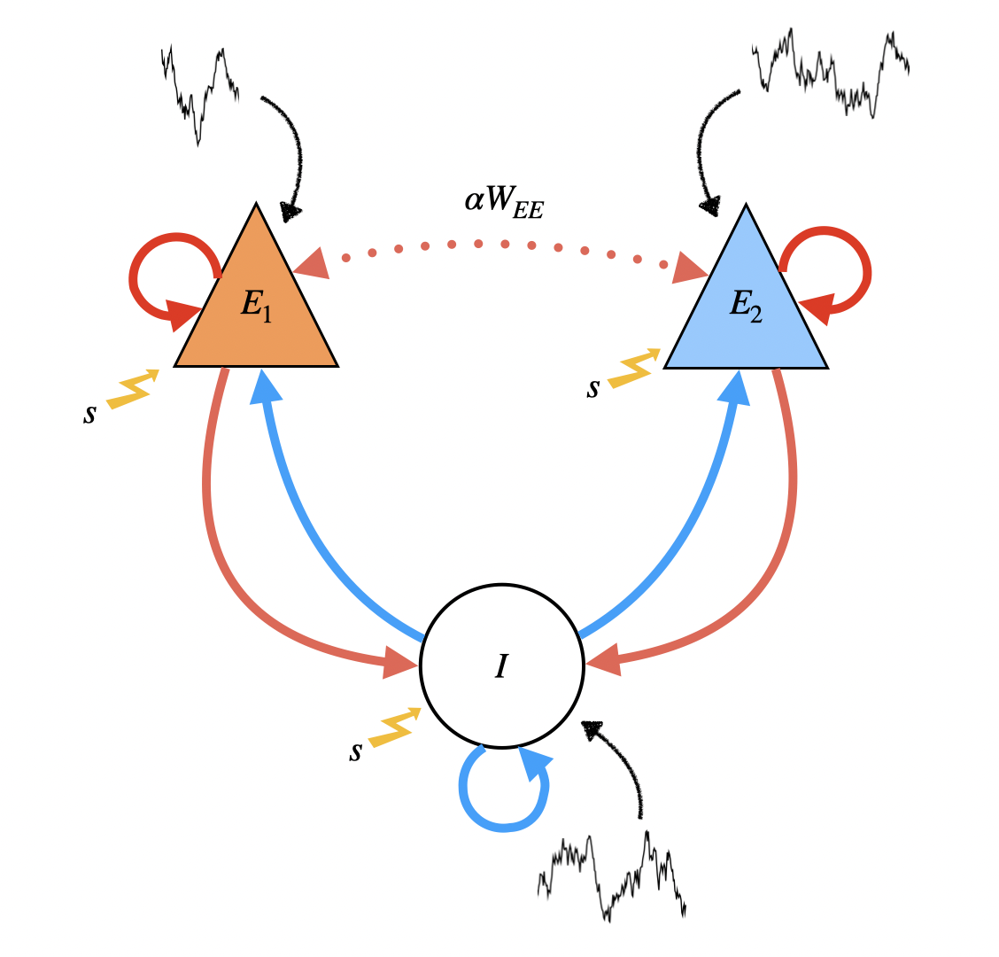

$$
\DeclareMathOperator{\Cov}{Cov}
\DeclareMathOperator{\Corr}{Corr}
\DeclareMathOperator{\Var}{Var}
\DeclareMathOperator{\prob}{\mathbb{P}}
\DeclareMathOperator{\qprob}{\mathbb{Q}}
\DeclareMathOperator{\E}{\mathbb{E}}
\newcommand{\set}[1]{\left\{#1\right\}}
\newcommand{\pa}[1]{\left(#1\right)}
\newcommand{\ang}[1]{\left<#1\right>}
\newcommand{\bra}[1]{\left[#1\right]}
\newcommand{\abs}[1]{\left|#1\right|}
\newcommand{\norm}[1]{\left\|#1\right\|}
$$

# Three unit rate model

## Three-unit model.

Neurons $\set{E_1,E_2,E_I}$ evolve with dynamics described by

$$
	\tau_i \dot{r}_i(t) = - r_i(t) + \bra{\mu_i + \sum_{j\in\set{E_1,E_2,I}}W_{ij}r_j(t)  + \sqrt{2\sigma_i}\xi_i(t)}_+, \qquad \text{for }i \in \set{E_1,E_2,I}
$$

^0898d9

where: 

- $\xi_i(t)$ are mutually independent white noise processes,
- $\tau_i$ are time constants
- $\sigma_i$ is the noise magnitude 
- $\mu_i$ is stimulus input to $i$ 
- $\bra{\cdot}_+ : \mathbb{R} \to \mathbb{R}$ is defined via $\bra{\cdot}\equiv \max\set{\cdot, 0}$ 

We may drop the $\bra{\cdot}_+$ under the assumption that the threshold is never sampled for sufficiently strong inputs.

### Weak cross-excitatory connection.

To implement a weak $E_1 \leftrightarrow E_2$ connection, we introduce a parameter $\alpha \in \pa{0,1}$  which scales inter-excitatory connections $W_{E_1E_2}$ , $W_{E_2E_1}$  with respect to the intra-excitatory connections $W_{E_1E_1}, W_{E_2E_2}$ respectively. Refer to the following sketch of the network setup for the three unit $\set{E_1,E_2,I}$ case: 

In vector form, the dynamical equations are 

$$\begin{aligned}
	\underbrace{\begin{bmatrix}
		\tau_{E_1} & 0 & 0 \\
		0 & \tau_{E_2} & 0 \\
		0 & 0 & \tau_I
	\end{bmatrix}}_{\boldsymbol{\tau}}	
	\begin{bmatrix}
		\dot{r}_{E_1} \\
		\dot{r}_{E_2} \\
		\dot{r}_{I}
	\end{bmatrix}
	=
	- \underbrace{\begin{bmatrix}
		r_{E_1} \\
		r_{E_2} \\
		r_{I}
		\end{bmatrix}}_{\mathbf{r}}
	+ 
		\underbrace{\begin{bmatrix}
			\mu_{E_1} \\
			\mu_{E_2} \\
			\mu_I
		\end{bmatrix}}_{\pmb{\mu}}
		& + 
		\underbrace{\begin{bmatrix}
			W_{E_1E_1} & W_{E_1E_2} & -W_{E_1I} \\
			W_{E_2E_1} & W_{E_2E_2} & - W_{E_2I}  \\
			W_{IE_1} & W_{IE_2} & -W_{II}
		\end{bmatrix}}_{\mathbf{W}}
		\begin{bmatrix}
			r_{E_1} \\
			r_{E_2}\\
			r_I
		\end{bmatrix} \\
		& \qquad +  
		\sqrt{2} 
		\underbrace{\begin{bmatrix}
			\sqrt{\sigma_{E_1}} & 0 & 0 \\
			0 & \sqrt{\sigma_{E_2}} &  0 \\
			0 & 0 & \sqrt{\sigma_{I}}
		\end{bmatrix}}_{\mathbf{S}}
		\underbrace{\begin{bmatrix}
			\xi_{E_1} \\
			\xi_{E_2}\\
			\xi_I
		\end{bmatrix}}_{\pmb{\xi}}
\end{aligned}$$

which can be written compactly as 
$$
\pmb{\tau} \mathbf{\dot{r}} = \pmb{\mu} + \pa{-\mathbf{1} + \mathbf{W}}\mathbf{r} + \sqrt{2}\mathbf{S} \pmb{\xi}.
$$
In the absence of noise, given $\mathbf{\bar{r}}$ we can solve for $\pmb{\mu}$ at the steady state (i.e., $\mathbf{\dot{r}}=0$)
$$
\pmb{\mu} = \pa{\mathbf{1} - \mathbf{W}}\mathbf{\bar{r}}.
$$
Let $\delta \mathbf{r} = \mathbf{r}-\mathbf{\bar{r}}$ denote the rates' fluctuations about their steady states. Then for sufficiently small noise, $\delta \mathbf{r}$ is an Ornstein-Uhlenbeck process given as the solution to the linear SDE 
$$
\frac{d}{dt}\delta \mathbf{r} = -\underbrace{\pmb{\tau}^{-1}\pa{\mathbf{1}-\mathbf{W}}}_{\mathbf{M}}\delta \mathbf{r} + \underbrace{\sqrt{2} \pmb{\tau}^{-1} \mathbf{S}}_{\mathbf{D}} \pmb{\xi} = -\mathbf{M} \delta \mathbf{r} + \mathbf{D} \pmb{\xi}.
$$

^e90dac

## Four-unit model.

The modeling setup for the three-unit network generalizes to $N_E$ excitatory and $N_I$ inhibitory neurons for a total of $N = N_E + N_I$ neurons. We will also be considering an $N=4$  neuron model with $\set{E_1,E_2,I_1,I_2}$ as the neurons. 

![[img/sketch-four_unit_setup.png]]

The dynamical equations for the four-unit model are identical to those of the three-unit model, only now we have additional variables to account for each of $I_1, I_2$. Note that the weight matrix is

$$
\mathbf{W} = 
\begin{bmatrix}
	W_{E_1E_1} & \alpha W_{E_2E_2} & - W_{E_1I_1} & -\beta W_{E_2I_2} \\
	\alpha W_{E_1E_1} & W_{E_2E_2} & - \beta W_{E_1I_1} & - W_{E_2I_2} \\
	W_{I_1E_1} & \gamma W_{I_2E_2} & - W_{I_1I_1} & -\zeta W_{I_2I_2} \\
	\gamma W_{I_1E_1} & W_{I_2E_2} & - \zeta W_{I_1I_1} & -W_{I_2I_2}
\end{bmatrix}.
$$

## Stability analysis

^6c6a55

For simplicity, assume $\boldsymbol{\tau}=\mathbf{1}$ and $\boldsymbol{\mu} = 0$. Assume there is no noise in the system, so that we are solving 

$$
\mathbf{\dot{r}}(t) = \pa{-\mathbf{1}+\mathbf{W}}\mathbf{r}(t).
$$

Since this is a linear equation, we seek solutions of the form 

$$
\mathbf{r}(t) = \mathbf{v}e^{\lambda t}, \qquad \mathbf{v} \in \mathbb{R}^{3}\text{ is a constant vector}
$$

Then: 

$$
	\pa{-\mathbf{1}+\mathbf{W}}\mathbf{v}e^{\lambda t} 
	= 
	\pa{-\mathbf{1}+ \mathbf{W}}\mathbf{r}(t)=\mathbf{\dot{r}}(t)
	= 
	\lambda\mathbf{v} e^{\lambda t} 
	\implies  
	\pa{-\mathbf{1}+\mathbf{W}}\mathbf{v}=\lambda \mathbf{v},
$$
that is, $\lambda$ must be an eigenvalue of $-\mathbf{1} + \mathbf{W}$, and $\mathbf{v}$ a corresponding eigenvector. The eigenvalues are obtained by solving 

$$
	\pa{-\mathbf{1}+\mathbf{W}}\mathbf{v} - \lambda \mathbf{v} = \pa{-\mathbf{1} + \mathbf{W} - \lambda \mathbf{1}}\mathbf{v} = 0.
$$

